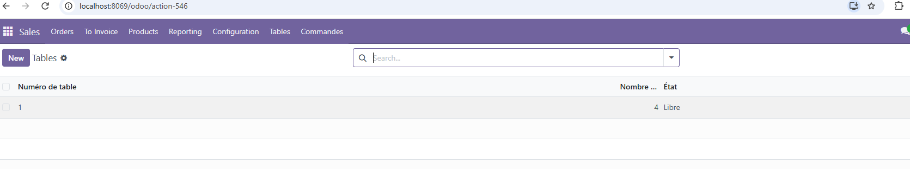
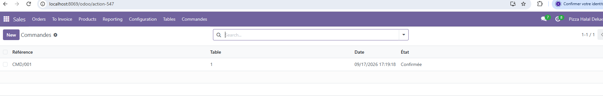

# Pizza Halal Deluxe — Odoo 18 Module

Custom Odoo module for restaurant table and order management.  
Complementary ERP project to the https://github.com/Samy801172/Stage_TFE_2025_Lemkadem_Abdeljalil (Angular / NestJS / PostgreSQL).

**Author:** Abdeljalil Lemkadem  
**Stack:** Odoo 18 · Python · XML · PostgreSQL · Docker Compose
---

## Captures d'écran

### Ventes → Tables


### Ventes → Commandes


---

---

## Features

| Model | Description |
|---|---|
| `pizzeria.table` | Physical tables (name, seats, state: free/occupied/reserved) |
| `pizzeria.order` | Restaurant orders linked to a table (`Many2one`) |

- List & form views, menus under **Sales**
- Access rights (`ir.model.access.csv`)
- Relational model: **Table 1 → N Orders** (`table_id` FK)

---

## Project structure

```
addons/pizzeria/
├── models/
│   ├── table.py          # pizzeria.table
│   └── order.py          # pizzeria.order + Many2one
├── views/
│   ├── table_views.xml
│   └── order_views.xml
├── security/
│   └── ir.model.access.csv
└── __manifest__.py

docker-compose.yml        # Odoo 18 + PostgreSQL 15
```

---

## Quick start

### Prerequisites

- [Docker Desktop](https://www.docker.com/products/docker-desktop/)

### Run

```bash
docker compose up -d
```

Open **http://localhost:8069** → create or select database → install module **Pizzeria**.

### Menus

- **Sales → Tables**
- **Sales → Commandes**

### PostgreSQL (DataGrip / psql)

| Setting | Value |
|---|---|
| Host | `localhost` |
| Port | **5433** |
| Database | your Odoo DB name |
| User / Password | `odoo` / `odoo` |

```sql
SELECT id, name, table_id, state FROM pizzeria_order;
```

---

## Skills demonstrated

- Relational modelling (MCD → ORM → SQL)
- Odoo module development (Python models, XML views, security)
- Docker containerization

---

## Related projects

https://github.com/Samy801172/Stage_TFE_2025_Lemkadem_Abdeljalil 

---

## License

Educational / portfolio project.
